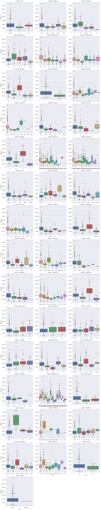
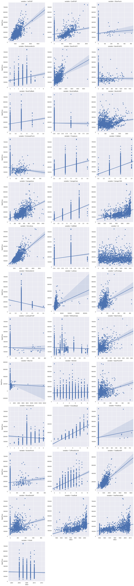
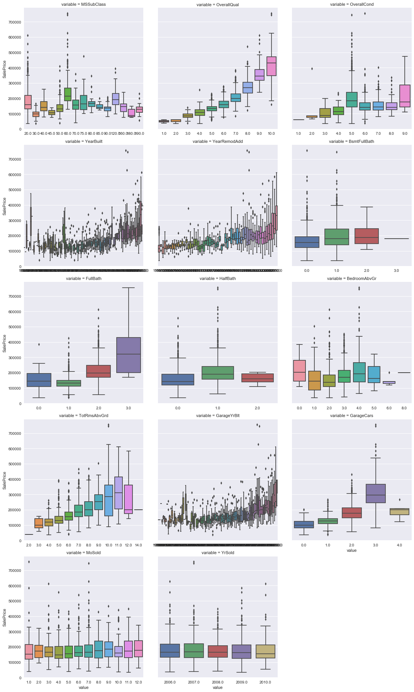
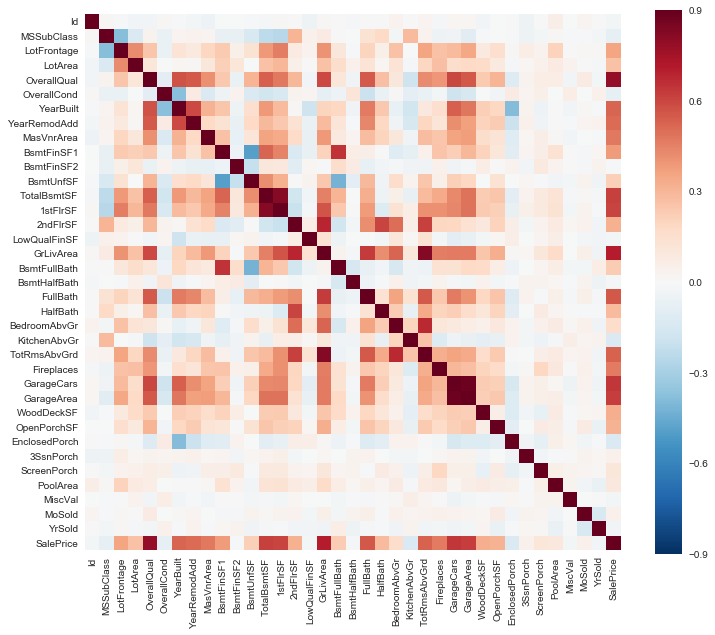
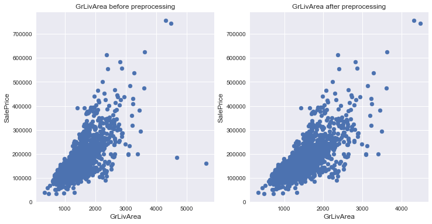
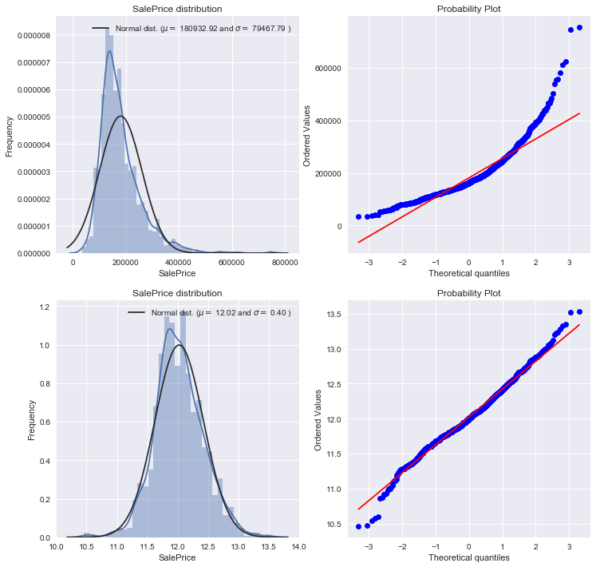

There is a competion which is posted on Kaggle named House Priced is very meaningful to me as it is the begining of my  game on Kaggle. 
I've read some great notebooks that are really helpful to learn the basic procedure of data mining and these really gave me loads of insparation of handling dataset and modeling. So I decided few days ago to finally join in this competition and apply some skills that I learnt so far. The overall procedure is listed below and I hope it will be easy to follow.


```python
# import some necessary libaries
import pandas as pd
import numpy as np
import matplotlib.pyplot as plt
import seaborn as sns
color = sns.color_palette()
sns.set_style('darkgrid')
%matplotlib inline

# ignore annoying warning (from sklearn and seaborn)
import warnings
def ignore_warn(*args, **kwargs):
    pass
warnings.warn = ignore_warn 

from scipy import stats
from scipy.stats import norm, skew # norm is not like norm in math, it's actualy normal distribution
```


```python
# import data
filepath = "F:\\Python_data_set\\House Prices\\"
train = pd.read_csv(filepath + "train.csv")
test  = pd.read_csv(filepath + "test.csv")

train.head()
print("train contains: {}".format(train.shape))
print("test contains: {}".format(test.shape))
```

    train contains: (1460, 81)
    test contains: (1459, 80)
    

# Data Exploration

Distinguish numeric and categorical features

Visualizing distribution and correlation


```python
features = pd.concat([train, test])
features.drop("SalePrice",axis=1,inplace=True)

numeric_feats = features.dtypes[features.dtypes!="object"].index
categorical_feats = features.dtypes[features.dtypes=="object"].index

print("all data contains: {}".format(features.shape))
print("numeric_feats are: {}".format(numeric_feats))
print("categorical_feats are: {}".format(categorical_feats))
```

    all data contains: (2919, 80)
    numeric_feats are: Index(['1stFlrSF', '2ndFlrSF', '3SsnPorch', 'BedroomAbvGr', 'BsmtFinSF1',
           'BsmtFinSF2', 'BsmtFullBath', 'BsmtHalfBath', 'BsmtUnfSF',
           'EnclosedPorch', 'Fireplaces', 'FullBath', 'GarageArea', 'GarageCars',
           'GarageYrBlt', 'GrLivArea', 'HalfBath', 'Id', 'KitchenAbvGr', 'LotArea',
           'LotFrontage', 'LowQualFinSF', 'MSSubClass', 'MasVnrArea', 'MiscVal',
           'MoSold', 'OpenPorchSF', 'OverallCond', 'OverallQual', 'PoolArea',
           'ScreenPorch', 'TotRmsAbvGrd', 'TotalBsmtSF', 'WoodDeckSF', 'YearBuilt',
           'YearRemodAdd', 'YrSold'],
          dtype='object')
    categorical_feats are: Index(['Alley', 'BldgType', 'BsmtCond', 'BsmtExposure', 'BsmtFinType1',
           'BsmtFinType2', 'BsmtQual', 'CentralAir', 'Condition1', 'Condition2',
           'Electrical', 'ExterCond', 'ExterQual', 'Exterior1st', 'Exterior2nd',
           'Fence', 'FireplaceQu', 'Foundation', 'Functional', 'GarageCond',
           'GarageFinish', 'GarageQual', 'GarageType', 'Heating', 'HeatingQC',
           'HouseStyle', 'KitchenQual', 'LandContour', 'LandSlope', 'LotConfig',
           'LotShape', 'MSZoning', 'MasVnrType', 'MiscFeature', 'Neighborhood',
           'PavedDrive', 'PoolQC', 'RoofMatl', 'RoofStyle', 'SaleCondition',
           'SaleType', 'Street', 'Utilities'],
          dtype='object')
    

## categorical features distribution

Temporally fill NA with Missing.

Viewing whether there are some categorical features linear to the label, like heatingQC and LotShape.


```python
train_show = train.copy()
for c in categorical_feats:
    train_show[c] = train_show[c].fillna("Missing")
        
def boxplot(x,y,**kwargs):                                                       
    sns.boxplot(x=x,y=y)

f = pd.melt(train_show,id_vars=['SalePrice'],value_vars=categorical_feats)         
g = sns.FacetGrid(f,col='variable',col_wrap=3,sharex=False,sharey=False,size=5)
g = g.map(boxplot,"value","SalePrice")                                       
```





## numeric features distribution

Viewing whether there are some bizzarre relationship between numeric features and the label


```python
# regplot: plot+linear regression
def regplot(x,y,**kwargs):
    sns.regplot(x=x,y=y)

f = pd.melt(train_show, id_vars=['SalePrice'],value_vars=numeric_feats)
g = sns.FacetGrid(f,col='variable',col_wrap=3,sharex=False,sharey=False,size=5)
g = g.map(regplot,"value","SalePrice")
```





Double check on some suspect features


```python
#nomial_feats=['MSSubClass','OverallQual','OverallCond','YearBuilt','YearRemodAdd','BsmtFullBath','FullBath','HalfBath',
#             'BedroomAbvGr','TotRmsAbvGrd','GarageYrBlt','GarageCars','MoSold','YrSold']
#for c in nomial_feats:
#    train_show[c] = train_show[c].fillna("Missing")

def boxplot(x,y,**kwargs):
    sns.boxplot(x=x,y=y)
    
f = pd.melt(train_show,id_vars=['SalePrice'],value_vars=nomial_feats)
g = sns.FacetGrid(f,col='variable',col_wrap=3,sharex=False,sharey=True,size=5)
g = g.map(boxplot,"value","SalePrice")
```





## data correlation 


```python
plt.figure(figsize=(12,10))
r = train_show.corr()
g = sns.heatmap(r,vmax=0.9,square=True)
```





# Data Preprocessing

## outlier

GrLivArea has a stong correlation with SalePrice, deleting its outliers would avoid affecting the prediction


```python
plt.figure(figsize=(12,6))
plt.subplot(121)
plt.scatter(train['GrLivArea'], train['SalePrice'])
plt.ylabel('SalePrice', fontsize=12)
plt.xlabel('GrLivArea', fontsize=12)
plt.title("GrLivArea before preprocessing")
print("GrLivArea before preprocessing: {}".format(train.shape))

train.drop(train[(train['GrLivArea']>4000)&(train.SalePrice<300000)].index,inplace=True)
features = pd.concat([train, test])
features.drop("SalePrice",axis=1,inplace=True)

plt.subplot(122)
plt.scatter(train['GrLivArea'], train['SalePrice'])
plt.ylabel('SalePrice', fontsize=12)
plt.xlabel('GrLivArea', fontsize=12)
plt.title("GrLivArea after preprocessing")
print("GrLivArea after preprocessing: {}".format(train.shape))
print("features:{}".format(features.shape))
```

    GrLivArea before preprocessing: (1460, 81)
    GrLivArea after preprocessing: (1458, 81)
    features:(2917, 80)
    





## normal distribution for label


```python
plt.figure(figsize=(12,12))
plt.subplot(221)
sns.distplot(train['SalePrice'] , fit=norm)
# Get the fitted parameters used by the function
(mu, sigma) = norm.fit(train['SalePrice'])
print( '\n mu = {:.2f} and sigma = {:.2f}\n'.format(mu, sigma))
plt.legend(['Normal dist. ($\mu=$ {:.2f} and $\sigma=$ {:.2f} )'.format(mu, sigma)],loc='best')
plt.ylabel('Frequency')
plt.title('SalePrice distribution')
#Get also the QQ-plot
#fig = plt.figure()
plt.subplot(222)
res = stats.probplot(train['SalePrice'], plot=plt)
#plt.show()

#We use the numpy fuction log1p which  applies log(1+x) to all elements of the column
train["SalePrice"] = np.log1p(train["SalePrice"])

#Check the new distribution 
plt.subplot(223)
sns.distplot(train['SalePrice'] , fit=norm)
# Get the fitted parameters used by the function
(mu, sigma) = norm.fit(train['SalePrice'])
print( '\n mu = {:.2f} and sigma = {:.2f}\n'.format(mu, sigma))
plt.legend(['Normal dist. ($\mu=$ {:.2f} and $\sigma=$ {:.2f} )'.format(mu, sigma)])
plt.ylabel('Frequency')
plt.title('SalePrice distribution')
#Get also the QQ-plot
#fig = plt.figure()
plt.subplot(224)
res = stats.probplot(train['SalePrice'], plot=plt)
#plt.show()
```

    
     mu = 180932.92 and sigma = 79467.79
    
    
     mu = 12.02 and sigma = 0.40
    
    





## missing data


```python
features.isnull().sum()[features.isnull().sum()>0].sort_values(ascending=False)
```


    PoolQC          2908
    MiscFeature     2812
    Alley           2719
    Fence           2346
    FireplaceQu     1420
    LotFrontage      486
    GarageQual       159
    GarageCond       159
    GarageFinish     159
    GarageYrBlt      159
    GarageType       157
    BsmtExposure      82
    BsmtCond          82
    BsmtQual          81
    BsmtFinType2      80
    BsmtFinType1      79
    MasVnrType        24
    MasVnrArea        23
    MSZoning           4
    BsmtFullBath       2
    BsmtHalfBath       2
    Utilities          2
    Functional         2
    Electrical         1
    BsmtUnfSF          1
    Exterior1st        1
    Exterior2nd        1
    TotalBsmtSF        1
    GarageArea         1
    GarageCars         1
    BsmtFinSF2         1
    BsmtFinSF1         1
    KitchenQual        1
    SaleType           1
    dtype: int64


PoolQC: data description says NA means "No Pool". That make sense, given the huge ratio of missing value (+99%) and majority of houses have no Pool at all in general.


```python
features["PoolQC"] = features["PoolQC"].fillna("None")
```

MiscFeature : data description says NA means "no misc feature"


```python
features["MiscFeature"] = features["MiscFeature"].fillna("None")
```

Alley : data description says NA means "no alley access"


```python
features["Alley"] = features["Alley"].fillna("None")
```

Fence : data description says NA means "no fence"


```python
features["Fence"] = features["Fence"].fillna("None")
```

FireplaceQu : data description says NA means "no fireplace"


```python
features["FireplaceQu"] = features["FireplaceQu"].fillna("None")
```

LotFrontage : Since the area of each street connected to the house property most likely have a similar area to other houses in its neighborhood , we can fill in missing values by the median LotFrontage of the neighborhood.


```python
#Group by neighborhood and fill in missing value by the median LotFrontage of all the neighborhood
features["LotFrontage"] = features.groupby("Neighborhood")["LotFrontage"].transform(
    lambda x: x.fillna(x.median()))
```

GarageType, GarageFinish, GarageQual and GarageCond : Replacing missing data with None


```python
for col in ('GarageType', 'GarageFinish', 'GarageQual', 'GarageCond'):
    features[col] = features[col].fillna('None')
```

GarageYrBlt, GarageArea and GarageCars : Replacing missing data with 0 (Since No garage = no cars in such garage.)


```python
for col in ('GarageYrBlt', 'GarageArea', 'GarageCars'):
    features[col] = features[col].fillna(0)
```

BsmtFinSF1, BsmtFinSF2, BsmtUnfSF, TotalBsmtSF, BsmtFullBath and BsmtHalfBath : missing values are likely zero for having no basement


```python
for col in ('BsmtFinSF1', 'BsmtFinSF2', 'BsmtUnfSF','TotalBsmtSF', 'BsmtFullBath', 'BsmtHalfBath'):
    features[col] = features[col].fillna(0)
```

BsmtQual, BsmtCond, BsmtExposure, BsmtFinType1 and BsmtFinType2 : For all these categorical basement-related features, NaN means that there is no basement.


```python
for col in ('BsmtQual', 'BsmtCond', 'BsmtExposure', 'BsmtFinType1', 'BsmtFinType2'):
    features[col] = features[col].fillna('None')
```

MasVnrArea and MasVnrType : NA most likely means no masonry veneer for these houses. We can fill 0 for the area and None for the type. 


```python
features["MasVnrType"] = features["MasVnrType"].fillna("None")
features["MasVnrArea"] = features["MasVnrArea"].fillna(0)
```

MSZoning (The general zoning classification) : 'RL' is by far the most common value. So we can fill in missing values with 'RL'


```python
features['MSZoning'] = features['MSZoning'].fillna(features['MSZoning'].mode()[0])
```

Utilities : For this categorical feature all records are "AllPub", except for one "NoSeWa" and 2 NA . Since the house with 'NoSewa' is in the training set, this feature won't help in predictive modelling. We can then safely remove it.


```python
features = features.drop(['Utilities'], axis=1)
```

Functional : data description says NA means typical


```python
features["Functional"] = features["Functional"].fillna("Typ")
```

Electrical : It has one NA value. Since this feature has mostly 'SBrkr', we can set that for the missing value.


```python
features['Electrical'] = features['Electrical'].fillna(features['Electrical'].mode()[0])
```

KitchenQual: Only one NA value, and same as Electrical, we set 'TA' (which is the most frequent) for the missing value in KitchenQual.


```python
features['KitchenQual'] = features['KitchenQual'].fillna(features['KitchenQual'].mode()[0])
```

Exterior1st and Exterior2nd : Again Both Exterior 1 & 2 have only one missing value. We will just substitute in the most common string


```python
features['Exterior1st'] = features['Exterior1st'].fillna(features['Exterior1st'].mode()[0])
features['Exterior2nd'] = features['Exterior2nd'].fillna(features['Exterior2nd'].mode()[0])
```

SaleType : Fill in again with most frequent which is "WD


```python
features['SaleType'] = features['SaleType'].fillna(features['SaleType'].mode()[0])
```

MSSubClass : Na most likely means No building class. We can replace missing values with None


```python
features['MSSubClass'] = features['MSSubClass'].fillna("None")
```


```python
#Check remaining missing values if any 
features_na = (features.isnull().sum() / len(features)) * 100
features_na = features_na.drop(features_na[features_na == 0].index).sort_values(ascending=False)
missing_data = pd.DataFrame({'Missing Ratio' :features_na})
missing_data.head()
```


<div>
<style>
    .dataframe thead tr:only-child th {
        text-align: right;
    }

    .dataframe thead th {
        text-align: left;
    }

    .dataframe tbody tr th {
        vertical-align: top;
    }
</style>
<table border="1" class="dataframe">
  <thead>
    <tr style="text-align: right;">
      <th></th>
      <th>Missing Ratio</th>
    </tr>
  </thead>
  <tbody>
  </tbody>
</table>
</div>


# Feature Engineering

## delete feature
delete useless, one of the features that correlate to each other, features been eliminated by param importance


```python
features.drop(['Id',"PoolQC","Street"],axis=1,inplace=True)
#features.drop(['Id',"GarageArea","GarageYrBlt","PoolQC","Street"],axis=1,inplace=True)
```

## add new feature


```python
# Adding total sqfootage feature 
features['TotalSF'] = features['TotalBsmtSF'] + features['1stFlrSF'] + features['2ndFlrSF']
```

## numeric2categorical
from observing numeric feautres disstribution


```python
features.YrSold = features.YrSold.astype(str)
features.MoSold = features.MoSold.astype(str)
features.MSSubClass = features.MSSubClass.astype(str)
features.HalfBath = features.HalfBath.astype(str)
#features.BedroomAbvGr = features.BedroomAbvGr.astype(str)
#features.GarageCars = features.GarageCars.astype(str)
#features.OverallCond = features.OverallCond.astype(str)
```

## categorical2numeric
from observing categorical feautres disstribution


```python
# label encoding
from sklearn.preprocessing import LabelEncoder

cols = ('FireplaceQu', 'BsmtQual', 'BsmtCond', 'GarageQual', 'GarageCond', 
        'ExterQual', 'ExterCond','HeatingQC',  'KitchenQual', 'BsmtFinType1', 
        'BsmtFinType2', 'Functional', 'Fence', 'BsmtExposure', 'GarageFinish', 'LandSlope',
        'LotShape', 'PavedDrive', 'Alley', 'CentralAir')

# process columns, apply LabelEncoder to categorical features
for c in cols:
    lbl = LabelEncoder() 
    lbl.fit(list(features[c].values)) 
    features[c] = lbl.transform(list(features[c].values))

# shape        
print('Shape features: {}'.format(features.shape))
```

    Shape features: (2917, 77)
    

## skew features
normal distribution for features with high skewness by using boxcox1p


```python
from scipy.stats import skew
from scipy.special import boxcox1p
numeric_feats = features.dtypes[features.dtypes != "object"].index

skewed_feats = features[numeric_feats].apply(lambda x: skew(x.dropna())) #compute skewness
skewed_feats = skewed_feats[abs(skewed_feats) > 0.75].index

lam=0.15
features[skewed_feats] = boxcox1p(features[skewed_feats],lam)
```

## get dummy
OneHotEncoder


```python
category_feats = features.dtypes[features.dtypes == "object"].index
features = pd.get_dummies(features,columns=category_feats)   
print(features.shape)
```

    (2917, 250)
    

## new train and test 


```python
train_features = features[:train.shape[0]]
test_features  = features[train.shape[0]:]
train_labels   = train["SalePrice"].values
```

## normalization

RobustScaler: robust to the outliers


```python
from sklearn.preprocessing import RobustScaler,StandardScaler
RS = RobustScaler()
RS.fit(train_features)
train_features_scale = RS.transform(train_features)
test_features_scale = RS.transform(test_features)
```

# Modelling

## import lib


```python
from sklearn.linear_model import ElasticNet, Lasso,  BayesianRidge, LassoLarsIC
from sklearn.ensemble import RandomForestRegressor,  GradientBoostingRegressor
from sklearn.kernel_ridge import KernelRidge
from sklearn.pipeline import make_pipeline
from sklearn.preprocessing import RobustScaler
from sklearn.base import BaseEstimator, TransformerMixin, RegressorMixin, clone
from sklearn.model_selection import KFold, cross_val_score, train_test_split
from sklearn.metrics import mean_squared_error
from sklearn.model_selection import GridSearchCV
import xgboost as xgb
import lightgbm as lgb
```

## cv coding
Cross validation and scoring by using rmse


```python
from sklearn.model_selection import cross_val_score

#Validation function
n_folds = 5

def rmse_cv(model):
    kf = KFold(n_folds, shuffle=True, random_state=42).get_n_splits(train_features_scale)
    rmse= np.sqrt(-cross_val_score(model, train_features_scale, train_labels, scoring="neg_mean_squared_error", cv = kf))
    return(rmse)
```

## gridSearch coding


```python
def param_select(model,param):
    kf = KFold(n_folds, shuffle=True, random_state=42).get_n_splits(train_features_scale)
    models = GridSearchCV(model,param,scoring="neg_mean_squared_error",cv=kf)
    models.fit(train_features_scale,train_labels)
    return models.best_estimator_,models.best_params_
```

## base models

### Lasso 


```python
param = {"alpha": np.logspace(-5,0,100).round(5)}
lasso,best_param = param_select(Lasso(),param)
print(best_param)
```

    {'alpha': 0.00046000000000000001}
    


```python
df = pd.DataFrame({"columns":list(train_features.columns), "coef":list(lasso.coef_.T)})
df_0 = df.loc[np.abs(df.coef) <= 1e-6]
df_0.loc[[a.find("_")==-1 for a in df_0["columns"]]]
```


<div>
<style>
    .dataframe thead tr:only-child th {
        text-align: right;
    }

    .dataframe thead th {
        text-align: left;
    }

    .dataframe tbody tr th {
        vertical-align: top;
    }
</style>
<table border="1" class="dataframe">
  <thead>
    <tr style="text-align: right;">
      <th></th>
      <th>coef</th>
      <th>columns</th>
    </tr>
  </thead>
  <tbody>
    <tr>
      <th>1</th>
      <td>-0.0</td>
      <td>2ndFlrSF</td>
    </tr>
    <tr>
      <th>12</th>
      <td>0.0</td>
      <td>BsmtHalfBath</td>
    </tr>
    <tr>
      <th>28</th>
      <td>-0.0</td>
      <td>GarageQual</td>
    </tr>
    <tr>
      <th>34</th>
      <td>-0.0</td>
      <td>LandSlope</td>
    </tr>
    <tr>
      <th>39</th>
      <td>0.0</td>
      <td>MasVnrArea</td>
    </tr>
  </tbody>
</table>
</div>


```python
lasso = Lasso(alpha=0.00046)
```

### Elastic Net
made robust to outliers


```python
param = {"alpha": np.logspace(-5,0,100).round(5),"l1_ratio":np.linspace(0.1,0.9,18)}
ENet,best_param = param_select(ElasticNet(random_state=3),param)
print(best_param)
```

    {'alpha': 0.00051999999999999995, 'l1_ratio': 0.90000000000000002}
    


```python
df = pd.DataFrame({"columns":list(train_features.columns), "coef":list(ENet.coef_.T)})
df_0 = df.loc[np.abs(df.coef) <= 1e-6]
df_0.loc[[a.find("_")==-1 for a in df_0["columns"]]]
```


<div>
<style>
    .dataframe thead tr:only-child th {
        text-align: right;
    }

    .dataframe thead th {
        text-align: left;
    }

    .dataframe tbody tr th {
        vertical-align: top;
    }
</style>
<table border="1" class="dataframe">
  <thead>
    <tr style="text-align: right;">
      <th></th>
      <th>coef</th>
      <th>columns</th>
    </tr>
  </thead>
  <tbody>
    <tr>
      <th>1</th>
      <td>-0.0</td>
      <td>2ndFlrSF</td>
    </tr>
    <tr>
      <th>12</th>
      <td>0.0</td>
      <td>BsmtHalfBath</td>
    </tr>
    <tr>
      <th>28</th>
      <td>-0.0</td>
      <td>GarageQual</td>
    </tr>
    <tr>
      <th>34</th>
      <td>-0.0</td>
      <td>LandSlope</td>
    </tr>
    <tr>
      <th>39</th>
      <td>0.0</td>
      <td>MasVnrArea</td>
    </tr>
  </tbody>
</table>
</div>


```python
ENet = ElasticNet(alpha=0.00052,l1_ratio=0.9,random_state=3)
```

### Kernel Ridge


```python
param = {"alpha": np.logspace(-3,0,50).round(5),"degree":np.linspace(1,3,3),"coef0":np.linspace(-5,5,20)}
KRR,best_param = param_select(KernelRidge( kernel='polynomial'),param)
print(best_param)
```

    {'alpha': 0.051790000000000003, 'coef0': -4.4736842105263159, 'degree': 1.0}
    


```python
KRR = KernelRidge(alpha=0.05179, kernel='polynomial', degree=1, coef0=-4.47368)
```

### Gradient Boosting Regression
With huber loss that makes it robust to outliers


```python
GBoost = GradientBoostingRegressor(n_estimators=3000, learning_rate=0.05,
                                   max_depth=4, max_features='sqrt',
                                   min_samples_leaf=15, min_samples_split=10, 
                                   loss='huber', random_state =5)
```


```python
GBoost.fit(train_features_scale,train_labels)
df = pd.DataFrame({"columns":list(train_features.columns), "coef":list(GBoost.feature_importances_.T)})
df_0 = df.loc[np.abs(df.coef) <= 1e-6]
df_0.loc[[a.find("_")==-1 for a in df_0["columns"]]]
```


<div>
<style>
    .dataframe thead tr:only-child th {
        text-align: right;
    }

    .dataframe thead th {
        text-align: left;
    }

    .dataframe tbody tr th {
        vertical-align: top;
    }
</style>
<table border="1" class="dataframe">
  <thead>
    <tr style="text-align: right;">
      <th></th>
      <th>coef</th>
      <th>columns</th>
    </tr>
  </thead>
  <tbody>
    <tr>
      <th>45</th>
      <td>0.0</td>
      <td>PoolArea</td>
    </tr>
  </tbody>
</table>
</div>


### XGBoost 


```python
model_xgb = xgb.XGBRegressor(colsample_bytree=0.4603, gamma=0.0468, 
                             learning_rate=0.05, max_depth=3, 
                             min_child_weight=1.7817, n_estimators=2200,
                             reg_alpha=0.4640, reg_lambda=0.8571,
                             subsample=0.5213, silent=1,
                             random_state =7, nthread = -1)
```


```python
model_xgb.fit(train_features_scale,train_labels)
df = pd.DataFrame({"columns":list(train_features.columns), "coef":list(model_xgb.feature_importances_.T)})
df_0 = df.loc[np.abs(df.coef) <= 1e-6]
df_0.loc[[a.find("_")==-1 for a in df_0["columns"]]]
```


<div>
<style>
    .dataframe thead tr:only-child th {
        text-align: right;
    }

    .dataframe thead th {
        text-align: left;
    }

    .dataframe tbody tr th {
        vertical-align: top;
    }
</style>
<table border="1" class="dataframe">
  <thead>
    <tr style="text-align: right;">
      <th></th>
      <th>coef</th>
      <th>columns</th>
    </tr>
  </thead>
  <tbody>
    <tr>
      <th>2</th>
      <td>0.0</td>
      <td>3SsnPorch</td>
    </tr>
    <tr>
      <th>8</th>
      <td>0.0</td>
      <td>BsmtFinSF2</td>
    </tr>
    <tr>
      <th>12</th>
      <td>0.0</td>
      <td>BsmtHalfBath</td>
    </tr>
    <tr>
      <th>34</th>
      <td>0.0</td>
      <td>LandSlope</td>
    </tr>
    <tr>
      <th>38</th>
      <td>0.0</td>
      <td>LowQualFinSF</td>
    </tr>
    <tr>
      <th>45</th>
      <td>0.0</td>
      <td>PoolArea</td>
    </tr>
  </tbody>
</table>
</div>


### LightGBM  


```python
model_lgb = lgb.LGBMRegressor(objective='regression',num_leaves=5,
                              learning_rate=0.05, n_estimators=720,
                              max_bin = 55, bagging_fraction = 0.8,
                              bagging_freq = 5, feature_fraction = 0.2319,
                              feature_fraction_seed=9, bagging_seed=9,
                              min_data_in_leaf =6, min_sum_hessian_in_leaf = 11)
```


```python
model_lgb.fit(train_features_scale,train_labels)
df = pd.DataFrame({"columns":list(train_features.columns), "coef":list(model_lgb.feature_importances_.T)})
df_0 = df.loc[np.abs(df.coef) <= 1e-6]
df_0.loc[[a.find("_")==-1 for a in df_0["columns"]]]
```


<div>
<style>
    .dataframe thead tr:only-child th {
        text-align: right;
    }

    .dataframe thead th {
        text-align: left;
    }

    .dataframe tbody tr th {
        vertical-align: top;
    }
</style>
<table border="1" class="dataframe">
  <thead>
    <tr style="text-align: right;">
      <th></th>
      <th>coef</th>
      <th>columns</th>
    </tr>
  </thead>
  <tbody>
    <tr>
      <th>45</th>
      <td>0</td>
      <td>PoolArea</td>
    </tr>
  </tbody>
</table>
</div>


## base models scores


```python
score = rmse_cv(lasso)
print("\nLasso score: {:.4f} +/- {:.4f}\n".format(score.mean(), score.std()))
```

    
    Lasso score: 0.1101 +/- 0.0069
    
    


```python
score = rmse_cv(ENet)
print("ElasticNet score: {:.4f} +/- {:.4f}\n".format(score.mean(), score.std()))
```

    ElasticNet score: 0.1101 +/- 0.0069
    
    


```python
score = rmse_cv(KRR)
print("Kernel Ridge score: {:.4f} +/- {:.4f}\n".format(score.mean(), score.std()))
```

    Kernel Ridge score: 0.1124 +/- 0.0066
    
    


```python
score = rmse_cv(GBoost)
print("Gradient Boosting score: {:.4f} +/- {:.4f}\n".format(score.mean(), score.std()))
```

    Gradient Boosting score: 0.1178 +/- 0.0077
    
    


```python
score = rmse_cv(model_xgb)
print("Xgboost score: {:.4f} +/- {:.4f}\n".format(score.mean(), score.std()))
```

    Xgboost score: 0.1157 +/- 0.0066
    
    


```python
score = rmse_cv(model_lgb)
print("LGBM score: {:.4f} +/- {:.4f}\n" .format(score.mean(), score.std()))
```

    LGBM score: 0.1159 +/- 0.0055
    
    

## Stacking models

### Averaged base models class
build a class to extend sklearn with our model

model.fit = fit for every models

model.predict = predict by using weighted mean


```python
class AveragingModels(BaseEstimator, RegressorMixin, TransformerMixin):
    def __init__(self, models, weights):
        self.models = models
        self.weights = weights
        
    # we define clones of the original models to fit the data in
    def fit(self, x_data, y_data):
        self.models_ = [clone(x) for x in self.models]
        # train cloned base models
        for model in self.models_:
            model.fit(x_data,y_data)
        return self
    
    # now we do the predictions for cloned models and average them
    def predict(self,x_data):
        predictions = np.column_stack([
            model.predict(x_data) for model in self.models_])
        return np.sum(self.weights*predictions, axis=1)
```

### Stucked base models class


```python
class StuckingModels(BaseEstimator, RegressorMixin, TransformerMixin):
    def __init__(self,BaseModels,MetaModel):
        self.BaseModels = BaseModels
        self.MetaModel  = MetaModel
        
    def fit(self,x_data,y_data):
        self.BaseModels_ = [list() for x in self.BaseModels]
        self.MetaModel_  = clone(self.MetaModel)
        kf = KFold(n_splits= 5, shuffle= True, random_state= 10)
        meta_fold = np.zeros((x_data.shape[0],len(self.BaseModels)))
        
        for i,model in enumerate(self.BaseModels):
            for train_index, test_index in kf.split(x_data,y_data):
                instance = clone(model)
                self.BaseModels_[i].append(instance)
                instance.fit(x_data[train_index],y_data[train_index])
                pred = instance.predict(x_data[test_index])
                meta_fold[test_index, i] = pred
                
        self.MetaModel_.fit(meta_fold,y_data) 
        return self
    
    def predict(self,x_data):
        meta_features = np.column_stack([
            np.column_stack([model.predict(x_data) for model in BaseModels]).mean(axis=1)
            for BaseModels in self.BaseModels_])
        return self.MetaModel_.predict(meta_features)
```

### Averaged base models score


```python
AveragedModels = AveragingModels(models=(lasso,ENet,KRR,GBoost,model_xgb,model_lgb),weights=(0.4,0.1,0.15,0.05,0.15,0.15))
score = rmse_cv(AveragedModels)
print(" Averaged base models score:{:.4f} +/- {:.4f}".format(score.mean(),score.std()))
```

     Averaged base models score:0.1084 +/- 0.0064
    

### Stucked base models score


```python
StuckedModels =StuckingModels(BaseModels=(ENet,KRR,GBoost,model_xgb,model_lgb),MetaModel=lasso)
score = rmse_cv(StuckedModels)
print(" Stucked base models score:{:.4f} +/- {:.4f}".format(score.mean(),score.std()))
```

     Stucked base models score:0.1079 +/- 0.0067
    

# Prediction


```python
StuckedModels.fit(train_features_scale,train_labels)
predict_log = StuckedModels.predict(test_features_scale)
pred = np.expm1(predict_log)
```


```python
filepath = "F:\\Python_data_set\\House Prices\\"
submission = pd.DataFrame({"Id":test.Id,"SalePrice":pred})
submission.to_csv(filepath + "submission.csv",index=False)
```


```python

```
